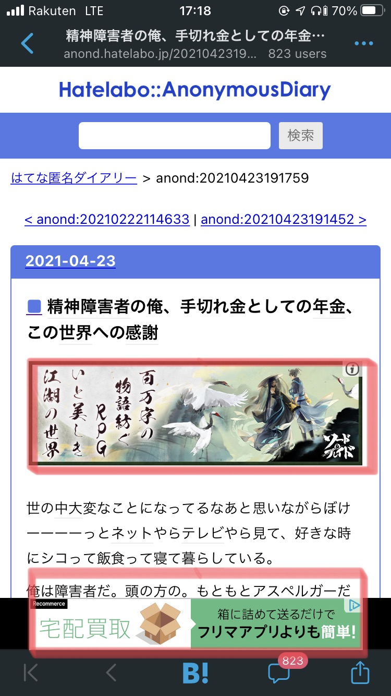
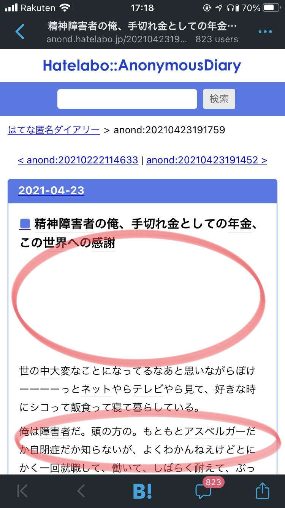

### アプリ内ブラウザでの広告が目障り
PCではブラウザ拡張のAdBlockなどを使用しているので広告除去ができている。  
しかし、スマートフォンのアプリ内ブラウザでは上記の方法で広告除去ができない。  
[Pi-holeというOSS](https://github.com/pi-hole/docker-pi-hole)でDNSサーバーを自前で立てて、スマートフォン側でDNSサーバーにPi-holeを指定することで、広告除去ができるようなので設定を行った。  
すでに録画サーバーをRaspiberry pi4で運用しているので、こちらにPi-holeをインストールすることにした。  
運用中の環境を汚したくないため、公式のdocker-composeファイルを利用してDNSサーバーを立てる。

### 環境
DNSサーバー
- Raspberry Pi4 4GB
- Ubuntu 20.04.1 LTS
- Docker version 19.03.8
- docker-compose version 1.27.4

### Pi-holeのセットアップ
基本的には[公式のドキュメント](https://github.com/pi-hole/docker-pi-hole)からdocker-composeファイルをコピペして動かすだけ。  
``` yml
version: "3"

# More info at https://github.com/pi-hole/docker-pi-hole/ and https://docs.pi-hole.net/
services:
  pihole:
    container_name: pihole
    image: pihole/pihole:latest
    ports:
      - "53:53/tcp"
      - "53:53/udp"
      - "67:67/udp"
      - "80:80/tcp"
    environment:
      TZ: 'America/Chicago'
      # WEBPASSWORD: 'set a secure password here or it will be random'
    # Volumes store your data between container upgrades
    volumes:
      - './etc-pihole/:/etc/pihole/'
      - './etc-DNSmasq.d/:/etc/DNSmasq.d/'
    # Recommended but not required (DHCP needs NET_ADMIN)
    #   https://github.com/pi-hole/docker-pi-hole#note-on-capabilities
    cap_add:
      - NET_ADMIN
    restart: unless-stopped
```
しかし、Ubuntu 17.10以降で利用する場合、デフォルトで有効になっているDNS resolverがPi-holeで使用する53ポートを既に使用しているため、コンテナを立ち上げる際にエラーが発生する。  
以下のコマンドでPi-holeが53ポートを使用できるようにする。  
`sudo sed -r -i.orig 's/#?DNSStubListener=yes/DNSStubListener=no/g' /etc/systemd/resolved.conf`  
`sudo sh -c 'rm /etc/resolv.conf && ln -s /run/systemd/resolve/resolv.conf /etc/resolv.conf`  
`systemctl restart systemd-resolved`  

コンテナの起動  
`docker-compose up -d`

クライアントからDNSサーバーを指定する際に、ipアドレスが必要なので確認しておく。  
`hostname -I`  


### クライアントの設定
スマートフォン(iPhone SE2)の設定は以下の手順で行った。  
DNSサーバーのアドレスは`192.168.0.10`とする。
1. 設定
1. Wi-Fi
1. 接続しているアクセスポイントのiマークをタップ
1. 画面下部のDNSを構成
1. 手動にチェックを入れる
1. すでに設定されているDNSサーバーをすべて削除
1. `192.168.0.10`を入力して保存

設定前  
  

設定後
  

### 所感
これで自宅Wi-Fiに接続していれば、スマートフォンのアプリ内ブラウザでも広告除去ができるようになった。  
しかし、外出先で閲覧した際には広告除去ができない。  
[tailscale](https://tailscale.com/)などを利用して外出先から自宅ネットワークに接続し、広告除去できるようにしたい。  