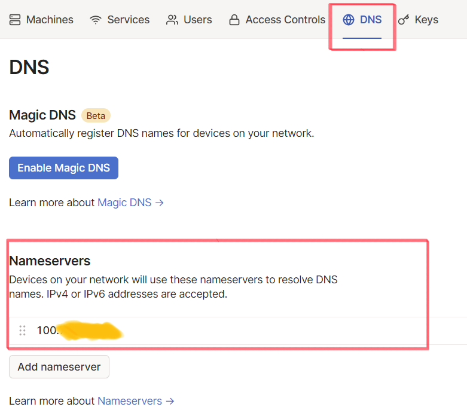

### 外出先でも広告ブロックがしたい
前回の[記事](http://eginoy.com/piholeで広告ブロック/)では、Pi-holeを利用して広告ブロックDNSサーバーを立てた。  
自宅Wi-Fiネットワーク接続時、DNSサーバーをPi-holeに指定することで広告除去ができるようになった。  
しかし、外出先ではモバイネットワークを利用するため、上記の方法で広告ブロックができない。  
外出先からでも広告ブロックが実現できるように、クラウド型VPNサービスの[tailscale](https://tailscale.com/)を利用する。

### tailscaleのインストールと設定
#### サインアップ
[tailscale](https://tailscale.com/)にサインアップしておく。  
(Google、Microsoftアカウントでのサインアップができるので便利。)

#### インストール
[公式のセットアップ手順](https://tailscale.com/download/linux)通りに、Pi-holeを構築しているLinuxマシン上で作業を行う。  

環境
- Raspberry Pi4 4GB
- Ubuntu 20.04.1 LTS

repositoryを登録  
``` sh
curl -fsSL https://pkgs.tailscale.com/stable/ubuntu/focal.gpg | sudo apt-key add -
```  
``` sh
curl -fsSL https://pkgs.tailscale.com/stable/ubuntu/focal.list | sudo tee /etc/apt/sources.list.d/tailscale.list
```  

tailscaleのインストール  
``` sh
sudo apt-get update
```
``` sh
sudo apt-get install tailscale
```

tailscaleにログイン
``` sh
sudo tailscale up
```
表示されたリンクにアクセスしてログインする。

tailscaleから割り当てられたIPアドレスの確認
``` sh
ip addr show tailscale0
```

クライアントにもアプリをインストールして、ログインしておく。

### tailscaleのNameServersにPi-holeのアドレス指定
tailscaleのDNS設定画面で、NameServersにPi-holeのアドレスを指定する。  
（100から始まるtailscale上のアドレスなので注意）  
  
tailscaleに接続しているクライアント（モバイネットワークなどから）で広告ブロックできていることが確認できれば成功。

### 所感
広告はWebサイト、スマートフォンアプリ運営費の収益源だったりするので必要なのは理解している。  
しかし、表示される広告は不愉快なもの（鼻の角栓画像、胸糞漫画、コンプレックスを煽るものなど）が多いので基本的にブロックするようになった。  
今回の作業で、外出先でも快適にスマートフォンを利用できるようになったので良かった。（まあ、全然外出しないが）