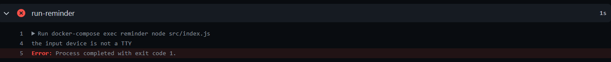
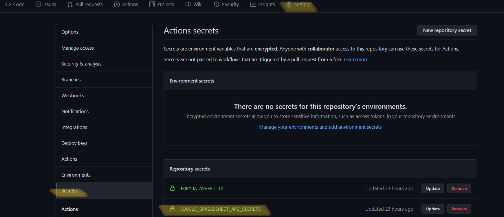

## 要約
[リポジトリ](https://github.com/eginoy/health-care-reminder)

自動化した作業の流れ
- Google Sheets APIを利用してデータ取得
- 取得したデータを元にメッセージを生成
- 生成したメッセージをIncomming Webhook宛に送信
- 上記の作業を平日1日1回定期的に実行

利用した技術
- Google Sheets API
- Node.js
- Docker
- Docker-Compose
- GitHub Actions

新たに学べたこと
- Google Sheets APIを利用したデータの取得方法
- GitHub Actionsの利用方法
- GitHub ActionsでのDocker-Compose実行方法
- GitHub Actionsでのシークレットキーの扱い方


## きっかけ
所属する会社ではコロナ禍が始まってから1日1回検温を行い[健康監視ツール](https://www.health-monitoring.net/)を利用して、Google Sheetsに記録をしている。  
健康監視を行う目的からして毎日漏れなく行うことが大切である。  
そのため、毎日終業時刻が近づくと未記録の人を確認してチャット上で記入催促を行う作業が発生した。  

最初に未記入者チェックを行った先輩が、その後も毎日チェックを行うようになった。  
明示的に誰が毎日の未記入者チェックを行うのか決めなかったため、この先輩が休暇中の時も未記入者チェックを行うようになってしまった。  
たとえ5分とかからない作業であっても、休暇中に業務を行わなければならない状況を改善したかったため、自動化を行うことにした。  
(休暇中、代わりにチェックを行う人を明示的に決めるなどすれば良いが、そもそも人が手作業で行う必要が無いので。)

## 自動化作業でのポイント
### Node.jsでIncomming Webhookにメッセージ送信
受け取り側はMicrosoft Teams

``` js
const axios = require('axios');
const postData = {text: remindMessage};
axios.post(webhookURL,postData);
```
[参考](https://qiita.com/penta515/items/074b5c7694b9bcec1043)

### GitHub Actions のAction作成
作業フォルダに`.github/workflows/action.yml`を配置

``` yml
name: run-reminder

on:
  workflow_dispatch: #これ書いとくと手動実行できるようになる。
  schedule:
   - cron: '00 7 * * 1-5' # 平日16時(github actions実行時間がUTCなので9時間マイナスで日本時間になる。)

jobs:
  build:
    runs-on: ubuntu-latest
    steps:
    - uses: actions/checkout@v2
    
    - name: run-compose
      env:
       HEALTHCAREINPUT_BASEURL: ${{secrets.HEALTHCAREINPUT_BASEURL}}
       SPREADSHEET_ID: ${{secrets.SPREADSHEET_ID}}
       FORMDATASHEET_ID: ${{secrets.FORMDATASHEET_ID}}
       USERMASTERSHEET_ID: ${{secrets.USERMASTERSHEET_ID}}
       WEBHOOK_URL: ${{secrets.WEBHOOK_URL}}    
      run: docker-compose up -d --build
    
    - name: copy-google-spreadsheet-api-credentials
      env:
       SPREADSHEET_SECRETS: ${{secrets.GOOGLE_SPREADSHEET_API_SECRETS}}
      run: echo $SPREADSHEET_SECRETS | base64 --decode --ignore-garbage > ./credentials.json
    
    - name: run-npm-install-on-container
      run: docker-compose exec -T reminder npm install
      
    - name: run-reminder
      run: docker-compose exec -T reminder node src/index.js

    - name: delete-credentials
      run: rm -rf ./credentials.json

    - name: stop-containers
      if: always()
      run: docker-compose down
```

#### 手動実行を可能にする
トリガーに`workflow_dispatch:`を指定することで、GitHub Actionsから手動実行が可能になる。  
[参考](https://docs.github.com/ja/actions/managing-workflow-runs/manually-running-a-workflow)


#### 定期実行
トリガーに`schedule:`を指定し`cron:`で記述できる。  
実行時間の基準がUTCなので日本時間で指定する際には`-9`時間する。  
例では月曜から金曜日の16時に実行するように設定している。  
ただし、指定した時間ピッタリには実行されないので注意。(一度試したら、指定時間+9分後に実行開始した。)  
[参考](https://matsuoshi.hatenablog.com/entry/2020/05/10/000000)

#### the input device is not a TTYエラー

`docker-compose exec -T reminder node src/index.js`  
のように`exec`コマンドに`-T`オプションをつける。  
[参考](https://www.nullpo.io/2020/05/11/git-github-actions-docker-compose/)

#### シークレットキーのjsonをAction内で扱う
APIキーなどが含まれたjsonはどうやって管理しているのか気になって検索していたらたどり着いた方法。  
今回調べた中で一番感心した。  
[参考](https://www.notion.so/bfe5bcffba6f489f9c4a2fa29451917c#971c95a2a1864aa0bde022b2d16f9f5a)
##### 1. credentials.jsonをbase64文字列で取得
`credentials.json`をAPIキーなどのシークレットキーを含んだjsonファイルとする。  
`cat ./credentials.json | base64`
##### 2. `1.` で出力したbase64文字列をGitHub Secretsに登録

##### 3. `2.` で登録したSecretsを環境変数として読み込みjsonファイルとして書き出す。
base64文字列をデコードしてjsonファイルへ書き出す。  
action内では以下の箇所で行っている。
``` yml
   - name: copy-google-spreadsheet-api-credentials
      env:
       SPREADSHEET_SECRETS: ${{secrets.GOOGLE_SPREADSHEET_API_SECRETS}}
      run: echo $SPREADSHEET_SECRETS | base64 --decode --ignore-garbage > ./credentials.json
```


### 所感など
GitHub Actionsは聞いたことがある程度で具体的に何ができるのか、何をするものなのかを知らなかった。  
今回のように定期的に軽い処理を実行したい場合など十分無料枠で足りるので、幅広い用途に利用でき便利だと思った。  

<p class='diamond'>&#9830;</p>

今回の自動化の処理部分を書くのに当たり、以前O'ReillyのTypeScript本を写経してから、一度もTypeScriptを利用していないことを思い出した。  
せっかくなので今回はJavaScriptではなく、TypeScriptで書こうとしたが環境構築につまずいてしまい、結局JavaScriptで書いてしまった。  
こういった機会が無いと業務で扱わない技術を利用することがないので、リファクタリングも兼ねてTypeScriptに書き直そうと思う。